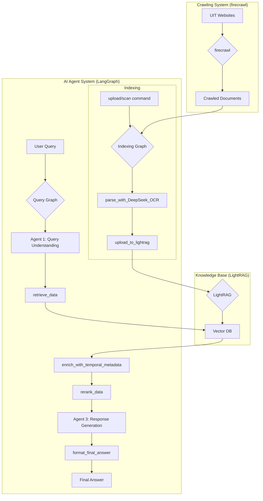

# Technical Report: UIT_DOCS_AGENT

## 1. Project Overview

This project, `UIT_DOCS_AGENT`, is a sophisticated, multi-component system designed to create a knowledgeable AI agent based on the content of Ho Chi Minh City University of Information Technology (UIT) websites. It features a complete RAG (Retrieval-Augmented Generation) pipeline, from data ingestion to intelligent query processing. The system is architected as a collection of services orchestrated with Docker and Docker Compose, with key components like `firecrawl` and `LightRAG` included as Git submodules.

## 2. System Architecture

The system is composed of three main parts:

1.  **Crawling System**: A self-hosted `firecrawl` instance scrapes and ingests documents from specified UIT web pages.
2.  **Knowledge Base**: A `LightRAG` instance processes the crawled documents, creating a searchable knowledge base with a vector database backend.
3.  **AI Agent System**: A multi-agent system built with `LangGraph` that handles both indexing new documents and intelligently answering user queries.

### Architecture Diagram



### Core Services (`docker-compose.yml`)

-   **`lightrag_uit`**: The core `LightRAG` application that serves the knowledge base API.
-   **`postgres_uit`**: PostgreSQL with `pgvector` for storing vector embeddings.
-   **`qdrant_uit`**: A Qdrant vector database for efficient similarity search.

### Crawling Services (`firecrawl/docker-compose.yaml`)

-   **`crawler`**: The main crawler service that uses the Firecrawl API to crawl websites.
-   **`api`**: The Firecrawl API service.
-   **`playwright-service`**: A service for rendering JavaScript-heavy pages.
-   **`redis`**: Used for job queuing.

## 3. Key Technologies

-   **Backend**: Python, FastAPI
-   **AI/LLM**: LangGraph, LangChain, LightRAG, DeepSeek-OCR
-   **Data Crawling**: Firecrawl, Playwright
-   **Databases**: PostgreSQL with pgvector, Qdrant, Redis
-   **Containerization**: Docker, Docker Compose

## 4. Data Ingestion Pipeline

Data ingestion is a two-step process involving crawling and indexing.

### Crawling

-   A `firecrawl` instance, defined in `firecrawl/docker-compose.yaml`, periodically crawls UIT websites based on the configuration in `firecrawl/config.yaml`.
-   The crawling starts from the seed URL `https://daa.uit.edu.vn` and follows links that match specific patterns (`/content`, `/thongbao`, etc.), up to a maximum depth of 10.
-   Crawled documents are saved to the shared `./data/` directory.

### Indexing (`LangGraph/src/agent/graphs/indexing_graph.py`)

The `indexing_graph` is a LangGraph workflow that processes and indexes new documents. It can be triggered by a user command (e.g., `upload /path/to/file`) or a manual `scan`.

The workflow is as follows:

1.  **Parse Command**: The user's input is parsed to determine the command (`upload_path`, `scan`, or `text`).
2.  **Prepare File List**: If the command is `upload_path`, a list of files is created from the given path.
3.  **Process Files**: Each file is processed one by one.
4.  **PDF Processing**: If a file is a PDF, it is processed with `DeepSeekOCRClient` to extract high-quality text and layout information.
5.  **Upload to Knowledge Base**: The processed content (or the original file) is uploaded to the `LightRAG` knowledge base using the `LightRAGAPIClient`.
6.  **Finalize**: A summary of the upload results is provided to the user.

## 5. Query & Response Pipeline (`LangGraph/src/agent/graphs/query_graph.py`)

The query processing is handled by a 2-agent temporal pipeline (v0.2.0) built with LangGraph.

1.  **Agent 1: Query Understanding**: Analyzes the user's query, tunes retrieval parameters (e.g., `top_k`, `retrieval_mode`), and can ask clarifying questions if the query is ambiguous.
2.  **Retrieval**: The system retrieves relevant data (entities, relationships, text chunks) from the `LightRAG` API using the (potentially tuned) query.
3.  **Temporal Enrichment**: Retrieved documents are enriched with temporal metadata (validity dates, cohort scope, amendment links) from PostgreSQL.
4.  **Reranking**: A `MultiSourceReranker` scores and re-ranks all retrieved data, combining semantic relevance with temporal freshness signals.
5.  **Agent 3: Response Generation**: Agent 3 synthesizes retrieved data and generates a direct answer for the user, with hyperlinked references. It can produce a full answer, a partial answer, or a fallback response.

> **Historical note:** Prior to v0.2.0, an intermediate Agent 2 (Confidence Assessment) sat between reranking and response generation. It was removed because its confidence gating added latency without measurably improving answer quality -- Agent 3 now handles quality judgment internally.

## 6. Dependencies

The project's Python dependencies are managed with `uv` and are defined in `pyproject.toml`. Key dependencies include:

-   `fastapi`
-   `langchain`
-   `langgraph`
-   `lightrag-hku`
-   `ollama`
-   `psycopg2-binary`
-   `pytesseract`
-   `transformers`

## 7. Building and Running

The project is designed to be run using Docker and Docker Compose.

### Running the Crawler

```bash
# Navigate to the firecrawl directory
cd firecrawl

# Start all crawling services
docker compose up -d
```

### Running the RAG System & Agent

```bash
# From the project root directory
docker compose up -d
```

The `lightrag_uit` service will expose the knowledge base API, which the LangGraph agent interacts with. The LangGraph agent itself is run as a separate Python application.
