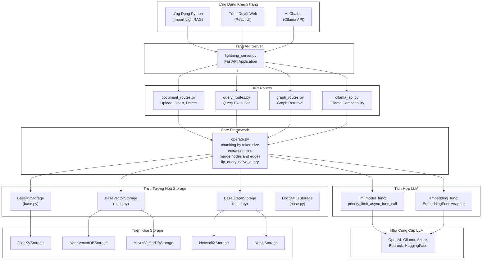

# Kiến Trúc LightRAG - Hệ Thống RAG Nâng Cao

## Sơ Đồ Kiến Trúc Tổng Quan

## Mô Tả Chi Tiết

### 1. Tầng Ứng Dụng Khách Hàng
- **Python Application**: Ứng dụng Python import thư viện LightRAG
- **Web Browser**: Giao diện React UI
- **AI Chatbot**: Tích hợp với Ollama API

### 2. Tầng API Server
- **lightning_server.py**: Ứng dụng FastAPI làm API Gateway

### 3. API Routes
- **document_routes.py**: Xử lý upload, insert, delete tài liệu
- **query_routes.py**: Thực thi các truy vấn
- **graph_routes.py**: Truy xuất dữ liệu đồ thị
- **ollama_api.py**: API tương thích với Ollama

### 4. Core Framework
- **operate.py**: Xử lý chunking, extract entities, merge nodes/edges, thực hiện truy vấn

### 5. Tích Hợp LLM
- **llm_model_func**: Gọi các model LLM với giới hạn ưu tiên
- **embedding_func**: Tạo embeddings cho văn bản

### 6. Storage Abstraction
- **BaseKVStorage**: Lưu trữ key-value
- **BaseVectorStorage**: Lưu trữ vector embeddings
- **BaseGraphStorage**: Lưu trữ đồ thị tri thức
- **DocStatusStorage**: Theo dõi trạng thái tài liệu

### 7. Storage Implementations
- **JsonKVStorage**: Lưu trữ KV bằng JSON
- **NanoVectorDBStorage**: Vector DB nhỏ gọn
- **MilvusVectorDBStorage**: Vector DB quy mô lớn
- **NetworkXStorage**: Đồ thị với NetworkX
- **Neo4jStorage**: Đồ thị với Neo4j

## Luồng Dữ Liệu

1. **Client** gửi request → **API Server**
2. **API Server** route request đến **API Routes** tương ứng
3. **API Routes** gọi **Core Framework** (operate.py)
4. **Core** sử dụng:
   - **LLM Integration** để xử lý văn bản
   - **Storage Abstraction** để lưu/đọc dữ liệu
5. **Storage Implementations** thực hiện lưu trữ thực tế

## Đặc Điểm Nổi Bật

- ✅ **Kiến trúc module hóa**: Tách biệt rõ ràng các layer
- ✅ **Abstraction Pattern**: Dễ dàng thay đổi storage backend
- ✅ **Multiple LLM Support**: Hỗ trợ nhiều nhà cung cấp LLM
- ✅ **Graph + Vector**: Kết hợp đồ thị tri thức và vector search
- ✅ **FastAPI**: API hiệu suất cao, async/await
- ✅ **Ollama Compatible**: Tích hợp với local LLM models
