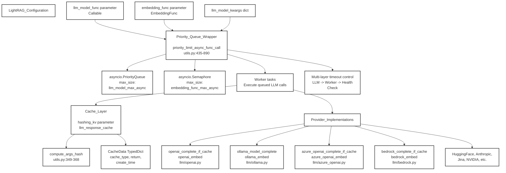

# LightRAG Configuration - Cấu Hình Hệ Thống

## Sơ Đồ Tổng Quan



---

## Chi Tiết Configuration

### 1. Parameters

#### llm_model_func (Callable)
```python
llm_model_func: Callable
```
**Chức năng:** 
- Hàm gọi LLM để sinh text
- Có thể là OpenAI, Ollama, Azure OpenAI, Bedrock, etc.
- Phải return text hoặc streaming response

---

#### embedding_func (EmbeddingFunc)
```python
embedding_func: EmbeddingFunc
```
**Chức năng:**
- Hàm tạo embeddings cho text
- Convert text thành vector representation
- Dùng cho vector search

---

#### llm_model_kwargs (dict)
```python
llm_model_kwargs: Dict[str, Any]
```
**Chức năng:**
- Các tham số bổ sung cho LLM
- Ví dụ: temperature, max_tokens, top_p, etc.

---

## Priority Queue Wrapper

### Chức Năng
```python
priority_limit_async_func_call(
    func: Callable,
    priority: int,
    max_async: int
)
```

**Mục đích:**
- Quản lý concurrent calls đến LLM/Embedding
- Tránh vượt rate limit
- Ưu tiên calls quan trọng hơn

### Hai Queue Chính

#### 1. asyncio.PriorityQueue
```python
llm_queue = asyncio.PriorityQueue(
    maxsize=llm_model_max_async
)
```
- Giới hạn concurrent LLM calls
- Priority-based scheduling

#### 2. asyncio.Semaphore
```python
embedding_semaphore = asyncio.Semaphore(
    embedding_func_max_async
)
```
- Giới hạn concurrent embedding calls
- Simple counting semaphore

---

## Worker Tasks

### Execute Queued LLM Calls

```python
async def worker():
    while True:
        priority, func, args, kwargs = await queue.get()
        try:
            result = await func(*args, **kwargs)
            return result
        finally:
            queue.task_done()
```

**Chức năng:**
- Lấy tasks từ queue theo priority
- Execute LLM/embedding calls
- Handle errors và timeouts
- Return results

---

## Cache Layer

### Hashing KV Parameter

```python
hashing_kv = llm_response_cache
```

**Chức năng:**
- Cache LLM responses để tránh gọi lại
- Dùng hash của input làm key

### compute_args_hash()

```python
def compute_args_hash(*args, **kwargs) -> str:
    # utils.py:349-368
    combined = str(args) + str(sorted(kwargs.items()))
    return hashlib.md5(combined.encode()).hexdigest()
```

**Mục đích:**
- Tạo unique hash cho mỗi LLM call
- Kiểm tra cache trước khi gọi API

### CacheData TypedDict

```python
class CacheData(TypedDict):
    cache_type: str      # "llm" hoặc "embedding"
    return: Any          # Cached result
    create_time: float   # Timestamp
```

---

## Provider Implementations

### 1. OpenAI
```python
# llm/openai.py
async def openai_complete_if_cache(
    prompt: str,
    system_prompt: str,
    **kwargs
) -> str

async def openai_embed(
    texts: List[str],
    **kwargs
) -> List[List[float]]
```

---

### 2. Ollama
```python
# llm/ollama.py
async def ollama_model_complete(
    prompt: str,
    system_prompt: str,
    **kwargs
) -> str

async def ollama_embed(
    texts: List[str],
    **kwargs
) -> List[List[float]]
```

---

### 3. Azure OpenAI
```python
# llm/azure_openai.py
async def azure_openai_complete_if_cache(
    prompt: str,
    system_prompt: str,
    **kwargs
) -> str

async def azure_openai_embed(
    texts: List[str],
    **kwargs
) -> List[List[float]]
```

---

### 4. Bedrock
```python
# llm/bedrock.py
async def bedrock_complete_if_cache(
    prompt: str,
    system_prompt: str,
    **kwargs
) -> str

async def bedrock_embed(
    texts: List[str],
    **kwargs
) -> List[List[float]]
```

---

### 5. Other Vendors

- **HuggingFace**: Transformers models
- **Anthropic**: Claude models
- **Jina**: Jina embeddings
- **NVIDIA**: NIM models
- **Google**: Gemini models
- **Cohere**: Cohere models

---

## Multi-layer Timeout Control

### 3 Lớp Kiểm Soát

```
1. LLM Level: timeout trong API call
   ↓
2. Worker Level: timeout trong worker task
   ↓
3. Health Check: theo dõi worker health
```

### Cấu Hình

```python
llm_timeout = 30          # seconds
worker_timeout = 60       # seconds
health_check_interval = 5 # seconds
```

---

## Luồng Hoạt Động

### 1. Khởi Tạo
```
LightRAG Configuration
  → Set llm_model_func
  → Set embedding_func
  → Set llm_model_kwargs
```

### 2. Wrap Functions
```
Functions → Priority_Queue_Wrapper
  → Create PriorityQueue
  → Create Semaphore
  → Start Worker Tasks
```

### 3. Execute Calls
```
Call LLM/Embedding
  → Add to Queue with Priority
  → Worker picks up task
  → Check Cache (compute_args_hash)
    → If cached: return from cache
    → If not: call provider
  → Save to Cache
  → Return result
```

### 4. Provider Routing
```
llm_model_func
  → Route to correct provider
    → OpenAI, Ollama, Azure, Bedrock, etc.
  → Execute with kwargs
  → Handle errors
  → Return result
```

---

## Bảng So Sánh Providers

| Provider | LLM Support | Embedding Support | Streaming | Cache |
|----------|-------------|-------------------|-----------|-------|
| **OpenAI** | ✅ GPT-4, GPT-3.5 | ✅ text-embedding-3 | ✅ | ✅ |
| **Ollama** | ✅ Local models | ✅ Local embeddings | ✅ | ✅ |
| **Azure OpenAI** | ✅ GPT-4, GPT-3.5 | ✅ text-embedding-ada | ✅ | ✅ |
| **Bedrock** | ✅ Claude, Llama | ✅ Titan embeddings | ✅ | ✅ |
| **HuggingFace** | ✅ Various | ✅ Various | ⚠️ Model dependent | ✅ |
| **Anthropic** | ✅ Claude | ❌ | ✅ | ✅ |

---

## Ưu Điểm Kiến Trúc

✅ **Rate limiting**: Tránh vượt API limits

✅ **Priority queue**: Ưu tiên calls quan trọng

✅ **Caching**: Giảm chi phí API

✅ **Multi-provider**: Dễ dàng switch providers

✅ **Async**: Xử lý nhiều calls đồng thời

✅ **Timeout control**: Tránh hanging calls

✅ **Error handling**: Graceful degradation

✅ **Extensible**: Dễ dàng thêm providers mới
