# LightRAG Instance - Cấu Trúc Storage

## Sơ Đồ Tổng Quan

```mermaid
flowchart TB
    Instance["LightRAG_Instance<br/><br/>LightRAG.post_init<br/>lightrag.py:387-581"]
    
    Instance --> Param1["working_dir parameter"]
    Instance --> Param2["workspace parameter"]
    Instance --> Config["Configuration<br/><br/>kv_storage<br/>vector_storage<br/>graph_storage<br/>doc_status_storage"]
    
    Param1 --> Storage["Storage_Instances"]
    Param2 --> Storage
    Config --> Storage
    
    Storage --> S1["self.text_chunks<br/>BaseKVStorage<br/>namespace:<br/>KV STORE TEXT CHUNKS"]
    
    Storage --> S2["self.full_docs<br/>BaseKVStorage<br/>namespace:<br/>KV STORE FULL DOCS"]
    
    Storage --> S3["self.full_entities<br/>BaseKVStorage<br/>namespace:<br/>KV STORE FULL ENTITIES"]
    
    Storage --> S4["self.full_relations<br/>BaseKVStorage<br/>namespace:<br/>KV STORE FULL RELATIONS"]
    
    Storage --> S5["self.llm_response_cache<br/>BaseKVStorage<br/>namespace:<br/>KV STORE LLM RESPONSE CACHE"]
    
    Storage --> S6["self.entities_vdb<br/>BaseVectorStorage<br/>namespace:<br/>VECTOR STORE ENTITIES"]
    
    Storage --> S7["self.relationships_vdb<br/>BaseVectorStorage<br/>namespace:<br/>VECTOR STORE RELATIONSHIPS"]
    
    Storage --> S8["self.chunks_vdb<br/>BaseVectorStorage<br/>namespace:<br/>VECTOR STORE CHUNKS"]
    
    Storage --> S9["self.chunk_entity_relation_graph<br/>BaseGraphStorage<br/>namespace:<br/>GRAPH STORE CHUNK ENTITY RELATION"]
    
    Storage --> S10["self.doc_status<br/>DocStatusStorage<br/>namespace:<br/>DOC STATUS"]
    
    style Instance fill:#fff,stroke:#333,stroke-width:2px
    style Param1 fill:#fff,stroke:#333,stroke-width:2px
    style Param2 fill:#fff,stroke:#333,stroke-width:2px
    style Config fill:#fff,stroke:#333,stroke-width:2px
    style Storage fill:#fff,stroke:#333,stroke-width:2px
    style S1 fill:#fff,stroke:#333,stroke-width:2px
    style S2 fill:#fff,stroke:#333,stroke-width:2px
    style S3 fill:#fff,stroke:#333,stroke-width:2px
    style S4 fill:#fff,stroke:#333,stroke-width:2px
    style S5 fill:#fff,stroke:#333,stroke-width:2px
    style S6 fill:#fff,stroke:#333,stroke-width:2px
    style S7 fill:#fff,stroke:#333,stroke-width:2px
    style S8 fill:#fff,stroke:#333,stroke-width:2px
    style S9 fill:#fff,stroke:#333,stroke-width:2px
    style S10 fill:#fff,stroke:#333,stroke-width:2px
```



---

## Chi Tiết Storage Instances

### 1. Key-Value Storage (5 instances)

#### text_chunks
```python
self.text_chunks = BaseKVStorage(
    namespace="KV STORE TEXT CHUNKS",
    working_dir=working_dir
)
```
**Chức năng:** Lưu trữ các text chunks đã được chia nhỏ

---

#### full_docs
```python
self.full_docs = BaseKVStorage(
    namespace="KV STORE FULL DOCS",
    working_dir=working_dir
)
```
**Chức năng:** Lưu trữ tài liệu gốc đầy đủ

---

#### full_entities
```python
self.full_entities = BaseKVStorage(
    namespace="KV STORE FULL ENTITIES",
    working_dir=working_dir
)
```
**Chức năng:** Lưu trữ danh sách entities đầy đủ

---

#### full_relations
```python
self.full_relations = BaseKVStorage(
    namespace="KV STORE FULL RELATIONS",
    working_dir=working_dir
)
```
**Chức năng:** Lưu trữ danh sách relationships đầy đủ

---

#### llm_response_cache
```python
self.llm_response_cache = BaseKVStorage(
    namespace="KV STORE LLM RESPONSE CACHE",
    working_dir=working_dir
)
```
**Chức năng:** Cache responses từ LLM để tăng tốc độ

---

### 2. Vector Storage (3 instances)

#### entities_vdb
```python
self.entities_vdb = BaseVectorStorage(
    namespace="VECTOR STORE ENTITIES",
    working_dir=working_dir,
    embedding_func=embedding_func
)
```
**Chức năng:** Vector database cho entity embeddings

---

#### relationships_vdb
```python
self.relationships_vdb = BaseVectorStorage(
    namespace="VECTOR STORE RELATIONSHIPS",
    working_dir=working_dir,
    embedding_func=embedding_func
)
```
**Chức năng:** Vector database cho relationship embeddings

---

#### chunks_vdb
```python
self.chunks_vdb = BaseVectorStorage(
    namespace="VECTOR STORE CHUNKS",
    working_dir=working_dir,
    embedding_func=embedding_func
)
```
**Chức năng:** Vector database cho chunk embeddings

---

### 3. Graph Storage (1 instance)

#### chunk_entity_relation_graph
```python
self.chunk_entity_relation_graph = BaseGraphStorage(
    namespace="GRAPH STORE CHUNK ENTITY RELATION",
    working_dir=working_dir
)
```
**Chức năng:** Graph database lưu trữ mối quan hệ giữa chunks, entities và relations

---

### 4. Document Status Storage (1 instance)

#### doc_status
```python
self.doc_status = DocStatusStorage(
    namespace="DOC STATUS",
    working_dir=working_dir
)
```
**Chức năng:** Theo dõi trạng thái xử lý của documents

---

## Cấu Trúc Configuration

### Tham Số Khởi Tạo

```python
def post_init(
    working_dir: str,          # Thư mục làm việc
    workspace: str,            # Workspace parameter
    kv_storage: str,           # Loại KV storage
    vector_storage: str,       # Loại Vector storage
    graph_storage: str,        # Loại Graph storage
    doc_status_storage: str    # Loại Doc Status storage
):
```

### Storage Types

| Loại Storage | Giá trị Mặc Định | Tùy Chọn Khác |
|--------------|------------------|---------------|
| **kv_storage** | JsonKVStorage | DictKVStorage, etc. |
| **vector_storage** | NanoVectorDBStorage | ChromaVectorDBStorage, etc. |
| **graph_storage** | NetworkXStorage | Neo4jStorage, etc. |
| **doc_status_storage** | JsonDocStatusStorage | - |

---

## Quy Trình Khởi Tạo

1. **LightRAG Instance** được tạo với `post_init()`
2. **Parameters** được truyền vào:
   - `working_dir`: Đường dẫn lưu trữ
   - `workspace`: Workspace identifier
3. **Configuration** được thiết lập:
   - Chọn loại storage cho từng component
4. **Storage Instances** được khởi tạo:
   - 5 BaseKVStorage instances
   - 3 BaseVectorStorage instances
   - 1 BaseGraphStorage instance
   - 1 DocStatusStorage instance

---

## Namespace Mapping

Mỗi storage instance có namespace riêng để tránh conflict:

```
text_chunks          → "KV STORE TEXT CHUNKS"
full_docs            → "KV STORE FULL DOCS"
full_entities        → "KV STORE FULL ENTITIES"
full_relations       → "KV STORE FULL RELATIONS"
llm_response_cache   → "KV STORE LLM RESPONSE CACHE"
entities_vdb         → "VECTOR STORE ENTITIES"
relationships_vdb    → "VECTOR STORE RELATIONSHIPS"
chunks_vdb           → "VECTOR STORE CHUNKS"
chunk_entity_relation_graph → "GRAPH STORE CHUNK ENTITY RELATION"
doc_status           → "DOC STATUS"
```

---

## Ưu Điểm Kiến Trúc

✅ **Tách biệt rõ ràng**: Mỗi loại dữ liệu có storage riêng

✅ **Linh hoạt**: Có thể thay đổi implementation của từng storage type

✅ **Scalable**: Dễ dàng mở rộng thêm storage instances

✅ **Cache-friendly**: LLM response cache giảm chi phí API

✅ **Namespace isolation**: Tránh conflict giữa các storage

✅ **Pluggable**: Có thể swap storage backend (JSON, ChromaDB, Neo4j, etc.)
