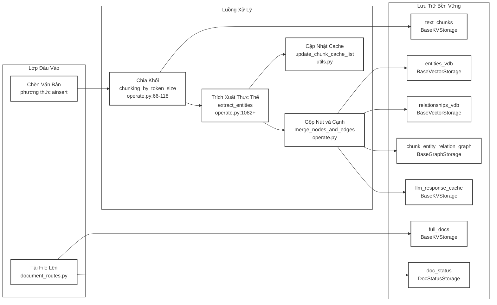
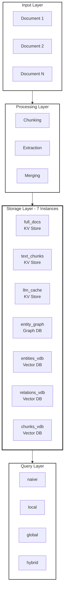
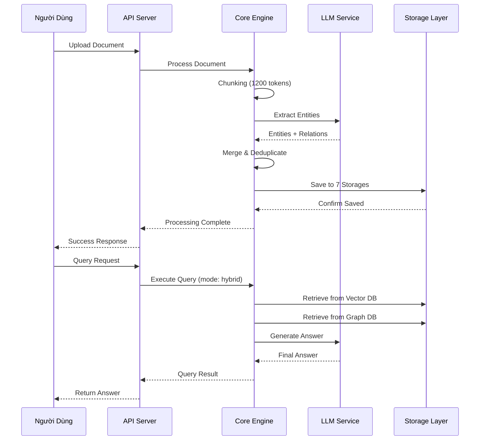

# LightRAG Pipeline - Luồng Xử Lý Dữ Liệu

## Sơ Đồ Pipeline Stages

## Chi Tiết Từng Giai Đoạn

### 1. Chunking
**Hàm:** `chunking_by_token_size`

**Chức năng:** 
- Chia tài liệu thành các chunks nhỏ có độ dài chồng lấp
- Mặc định: 1200 tokens, overlap 100 tokens
- Đảm bảo ngữ cảnh liên tục giữa các chunks

### 2. Entity Extraction
**Hàm:** `extract_entities`

**Chức năng:**
- Sử dụng LLM để trích xuất entities và relationships từ mỗi chunk
- Hỗ trợ gleaning iterations (lặp lại để cải thiện độ chính xác)
- Tạo ra graph structure từ text

### 3. Merging
**Hàm:** `merge_nodes_and_edges`

**Chức năng:**
- Gộp entities/relationships từ nhiều chunks
- Áp dụng map-reduce summarization khi cần
- Loại bỏ trùng lặp và normalize dữ liệu

### 4. Persistence
**Storage Instances:**

Lưu trữ dữ liệu đã xử lý qua 7 storage instances được quản lý bởi class `LightRAG`:

1. **full_docs** - Key-Value storage cho tài liệu gốc
2. **text_chunks** - Key-Value storage cho các chunks
3. **llm_response_cache** - Cache responses từ LLM
4. **chunk_entity_relation_graph** - Graph storage cho entities/relations
5. **entities_vdb** - Vector DB cho entity embeddings
6. **relationships_vdb** - Vector DB cho relationship embeddings  
7. **chunks_vdb** - Vector DB cho chunk embeddings

### 5. Query Modes

**4 chế độ truy vấn:**

1. **naive**: Truy vấn đơn giản trực tiếp
2. **local**: Tìm kiếm local context xung quanh entities
3. **global**: Tìm kiếm toàn cục trong graph
4. **hybrid**: Kết hợp local + global search

---

## Sơ Đồ Chi Tiết Storage Layer

---

## Luồng Dữ Liệu Chi Tiết

---

## So Sánh Query Modes

| Mode | Tốc Độ | Độ Chính Xác | Use Case |
|------|--------|--------------|----------|
| **naive** | ⚡⚡⚡ Rất nhanh | ⭐⭐ Trung bình | Truy vấn đơn giản, keyword search |
| **local** | ⚡⚡ Nhanh | ⭐⭐⭐ Tốt | Tìm kiếm trong ngữ cảnh local |
| **global** | ⚡ Chậm | ⭐⭐⭐⭐ Rất tốt | Phân tích toàn cục, tổng hợp |
| **hybrid** | ⚡⚡ Nhanh | ⭐⭐⭐⭐⭐ Xuất sắc | Kết hợp ưu điểm cả hai |

---

## Ưu Điểm Pipeline

✅ **Chunking thông minh**: Overlap tokens giữ ngữ cảnh

✅ **Entity-centric**: Tập trung vào entities và relationships

✅ **Multi-storage**: Tối ưu cho từng loại dữ liệu

✅ **Flexible queries**: 4 modes phù hợp mọi use case

✅ **Caching**: LLM response cache tăng tốc độ

✅ **Scalable**: Xử lý được lượng lớn documents
