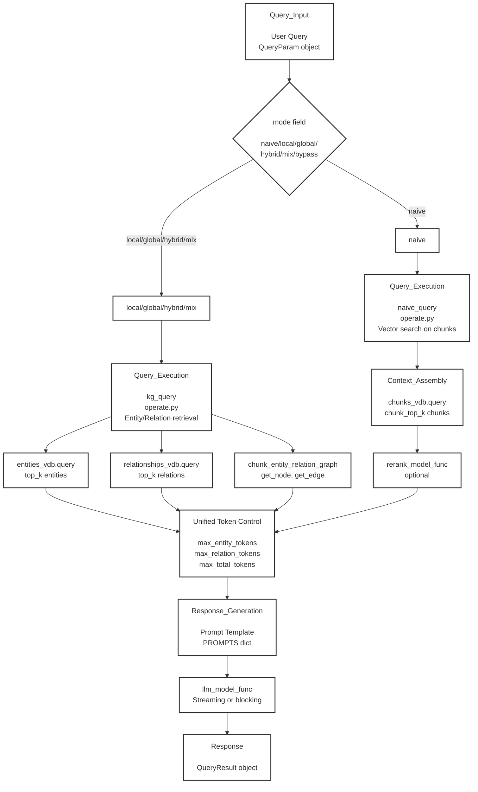

# LightRAG Query Modes - Các Chế Độ Truy Vấn

## Sơ Đồ Query Flow



---

## Bảng So Sánh Query Modes

| Mode | Hàm Thực Thi | Chiến Lược Truy Xuất |
|------|--------------|----------------------|
| **naive** | `naive_query()` | Chỉ tìm kiếm vector trên text chunks |
| **local** | `kg_query()` với entity focus | Lấy entities + chunks kết nối của chúng |
| **global** | `kg_query()` với relation focus | Lấy relationships + chunks kết nối của chúng |
| **hybrid** | `kg_query()` kết hợp cả hai | Lấy cả entities và relationships |
| **mix** | `kg_query()` cách tiếp cận cân bằng | Kết hợp KG và vector search |

---

## Chi Tiết Từng Mode

### 1. Naive Mode
```
Luồng: User Query → naive_query() → chunks_vdb.query() → Rerank (optional) → LLM
Đặc điểm:
- Nhanh nhất
- Chỉ dùng vector search
- Không dùng knowledge graph
- Phù hợp: Truy vấn đơn giản, keyword search
```

### 2. Local Mode
```
Luồng: User Query → kg_query(entity focus) → entities_vdb + connected chunks → LLM
Đặc điểm:
- Focus vào entities
- Lấy chunks có liên quan đến entities
- Context từ knowledge graph
- Phù hợp: Tìm kiếm thông tin về entities cụ thể
```

### 3. Global Mode
```
Luồng: User Query → kg_query(relation focus) → relationships_vdb + connected chunks → LLM
Đặc điểm:
- Focus vào relationships
- Phân tích mối quan hệ giữa entities
- Tầm nhìn toàn cục
- Phù hợp: Phân tích mối quan hệ, tổng hợp thông tin
```

### 4. Hybrid Mode
```
Luồng: User Query → kg_query(both) → entities + relationships + chunks → LLM
Đặc điểm:
- Kết hợp entities và relationships
- Độ chính xác cao nhất
- Context đầy đủ nhất
- Phù hợp: Truy vấn phức tạp, cần cả entities và relations
```

### 5. Mix Mode
```
Luồng: User Query → kg_query(balanced) → KG + vector search → LLM
Đặc điểm:
- Cân bằng giữa KG và vector search
- Linh hoạt
- Tối ưu giữa tốc độ và độ chính xác
- Phù hợp: Đa số các trường hợp sử dụng
```

---

## Token Control

### Unified Token Control
Kiểm soát số lượng tokens được gửi đến LLM:

- **max_entity_tokens**: Giới hạn tokens cho entities
- **max_relation_tokens**: Giới hạn tokens cho relationships
- **max_total_tokens**: Tổng tokens tối đa

### Chiến Lược:
1. Thu thập entities và relations từ VectorDB
2. Đếm tokens cho mỗi thành phần
3. Cắt bỏ nếu vượt giới hạn
4. Đảm bảo không vượt max_total_tokens

---

## Response Generation

### Prompt Templates (PROMPTS dict)
Mỗi query mode có prompt template riêng:

```python
PROMPTS = {
    "naive": "Answer based on chunks only...",
    "local": "Use entities and their context...",
    "global": "Analyze relationships globally...",
    "hybrid": "Combine entities and relationships...",
    "mix": "Balance KG and vector search..."
}
```

### LLM Execution
- **Streaming**: Trả về từng token (real-time)
- **Blocking**: Trả về toàn bộ response (batch)

---

## Context Assembly Process

### 1. Vector Search
```
chunks_vdb.query(query_text, top_k=10)
entities_vdb.query(query_embedding, top_k=20)
relationships_vdb.query(query_embedding, top_k=20)
```

### 2. Graph Retrieval
```
chunk_entity_relation_graph.get_node(entity_name)
chunk_entity_relation_graph.get_edge(source, target)
```

### 3. Reranking (Optional)
```
rerank_model_func(query, candidates) → sorted_results
```

### 4. Token Unification
```
Merge all contexts → Apply token limits → Format for LLM
```

---

## So Sánh Hiệu Suất

| Tiêu Chí | naive | local | global | hybrid | mix |
|----------|-------|-------|--------|--------|-----|
| **Tốc độ** | ⚡⚡⚡⚡⚡ | ⚡⚡⚡⚡ | ⚡⚡ | ⚡⚡⚡ | ⚡⚡⚡ |
| **Độ chính xác** | ⭐⭐ | ⭐⭐⭐ | ⭐⭐⭐⭐ | ⭐⭐⭐⭐⭐ | ⭐⭐⭐⭐ |
| **Token usage** | Thấp | Trung bình | Cao | Rất cao | Trung bình |
| **Context richness** | Thấp | Tốt | Tốt | Xuất sắc | Tốt |
| **Use case** | Simple Q&A | Entity search | Relation analysis | Complex queries | General purpose |
