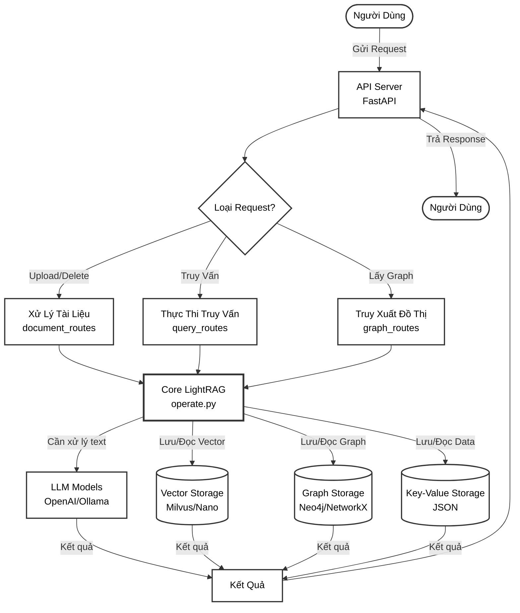
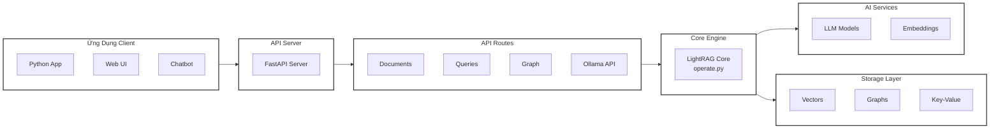
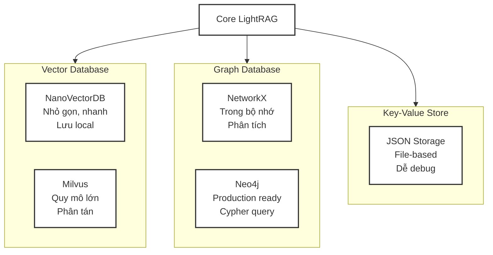

# Kiến Trúc LightRAG - Phiên Bản Đơn Giản

## Sơ Đồ Luồng Đơn Giản

## Giải Thích Luồng Xử Lý

### Bước 1: Nhận Request
- Người dùng gửi request đến **API Server** (FastAPI)

### Bước 2: Phân Loại Request
API Server phân loại request thành 3 loại:
1. **Upload/Delete Tài Liệu** → `document_routes.py`
2. **Truy Vấn Dữ Liệu** → `query_routes.py`
3. **Lấy Thông Tin Graph** → `graph_routes.py`

### Bước 3: Xử Lý Core
Tất cả requests đều đi qua **Core LightRAG** (`operate.py`) để:
- Chia nhỏ văn bản (chunking)
- Trích xuất entities và relationships
- Tạo embeddings
- Thực hiện truy vấn

### Bước 4: Tương Tác Storage
Core sử dụng 3 loại storage:
- **Vector Storage**: Lưu embeddings (Milvus/NanoVectorDB)
- **Graph Storage**: Lưu đồ thị tri thức (Neo4j/NetworkX)
- **Key-Value Storage**: Lưu metadata (JSON)

### Bước 5: Gọi LLM
Khi cần xử lý ngôn ngữ tự nhiên, Core gọi:
- OpenAI GPT models
- Ollama (local models)
- Azure OpenAI
- Bedrock, HuggingFace

### Bước 6: Trả Kết Quả
- Kết quả từ các storage và LLM được tổng hợp
- API Server trả response cho người dùng

---

## Sơ Đồ Thành Phần Chi Tiết

---

## So Sánh Storage Implementations

---

## Ưu Điểm Kiến Trúc

✅ **Module hóa cao**: Dễ bảo trì và mở rộng

✅ **Abstraction tốt**: Dễ thay đổi implementation

✅ **Async/Await**: Xử lý đồng thời hiệu quả

✅ **Multi-storage**: Tối ưu cho từng loại dữ liệu

✅ **LLM agnostic**: Hỗ trợ nhiều nhà cung cấp

✅ **Graph + Vector**: Kết hợp sức mạnh cả hai
